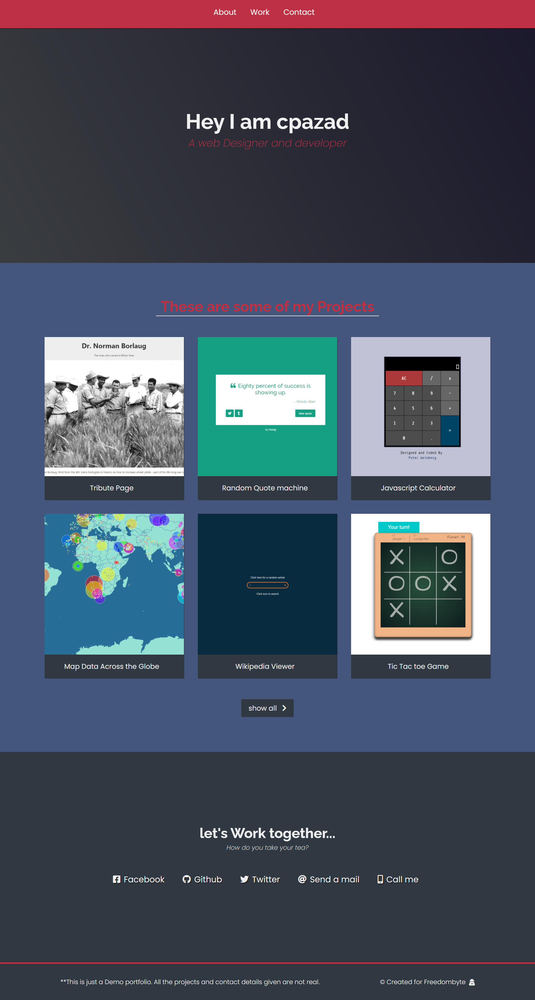

#### Project Name: Personal_Porfolio.
*freeCodeCamp* Responsive Web Development Program

This is the last project for freeCodeCamp Responsive web development program
You can see the project from the **live link below**  

Website: [Personal Porfolio](https://cpazad.github.io/Personal-Portfolio/)

Project Details:-
    Objectives: use HTML, JavaScript, and CSS to complete this project.
    Site plan is very siomple, 4 sections with nav bar and a simple footer
    Nav menu to connect with corresponding sections.
    One section with work samples - Samples are linked with sample page
    One with external links with social site and other relavant porfolio site. 
    How to: use HTML, and CSS to complete this project mainly.

Final Output:

Thank You. 